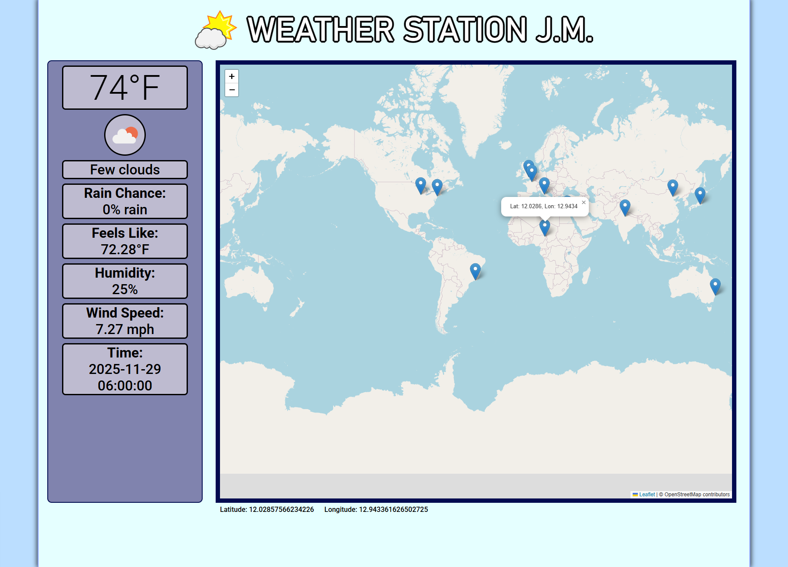

<h1 align="center">
  
</h1>

  <strong>🌦️ Interactive real-time weather map powered by Flask + OpenWeather API</strong>

  <a href="https://weatherstationjm.onrender.com" target="_blank">
    🌐 Live Website
  </a>

  

## 📌 Overview

**Weather Station J.M.** is an interactive weather-forecasting web app built with:

- **Python + Flask backend**
- **JavaScript + Leaflet.js front-end**
- **OpenWeather Forecast API**

Users can click anywhere on the world map and instantly see:

- 🌡️ Temperature  
- 💧 Humidity  
- 🌧️ Rain probability  
- 🌬️ Wind speed  
- 🌤️ Weather description + icon  
- 🕒 Forecast timestamp  
- 📍 The exact latitude/longitude clicked  

The backend is securely deployed on **Render**, using a `.env` file locally and `gitignore` to protect API keys.

## 🧩 Features

🗺️ Interactive world map (Leaflet.js)

📍 Click anywhere to retrieve weather

🏙️ Famous world landmarks pre-marked

🌡️ Dynamic temperature-based color theme

🔐 Secure environment variables

🚀 Auto-deployed backend on Render

⚡ 3-hour OpenWeather forecast retrieval

🎨 Clean UI with responsive layout

## 🛠️ Tech Stack

  <table width="100%">
    <tr valign="top">
      <td width="100%" align="center">
        <h3>🧩 Backend</h3>
        Python (Flask)
      </td>
      <td width="100%" align="center">
        <h3>🎨Frontend</h3>
        <ul style="text-align: left; display: inline-block;">
          <li>HTML</li>
          <li>CSS</li>
          <li>JavaScript</li>
          <li>Leaflet.js</li>
        </ul>
      </td>
      <td width="100%" align="center">
        <h3>🌤️ API</h3>
        <a href="https://openweathermap.org">OpenWeatherMap</a>
      </td>
    </tr>
  </table>

